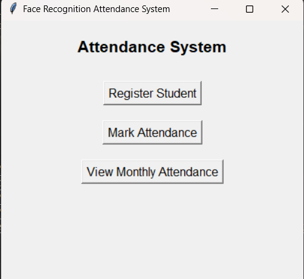
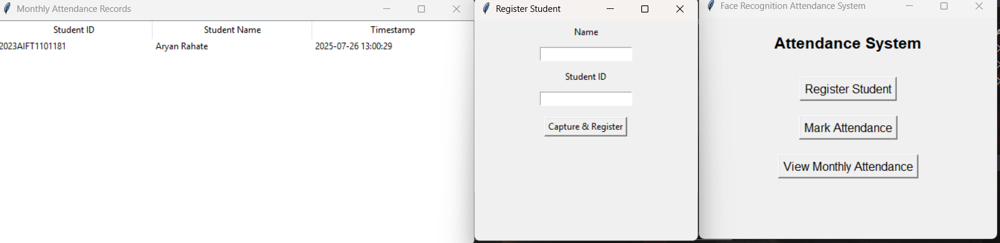

# Face Recognition Attendance Management System

## 🧠 Overview

The **Face Recognition Attendance Management System** is a desktop-based solution built with Python that uses your webcam and facial recognition to automatically mark attendance. It provides an intuitive GUI for:
- Registering students using face data,
- Capturing and saving facial encodings,
- Recognizing faces in real-time, and
- Logging attendance in a local SQLite database.

---

## ⚙️ Technologies Used

- 
- 
- 
- 
- 

---

## 🚀 Features

- 📸 **Capture Faces via Webcam** — No need to manually upload images.
- 🧠 **Real-time Face Recognition** — Matches face from the webcam to stored user data.
- 📝 **Attendance Marking** — Records attendance instantly in the SQLite database.
- 📊 **Monthly View of Attendance** — Tabular format view with student names, IDs, and timestamps.
- 🔐 **No Manual Authentication Required** — Your face is your identity.

---

## 🔁 System Flow

### 1. Register Student
- Open the GUI and enter the student's name and ID.
- Capture the face through the webcam.
- The system encodes the face and saves it as `<student_name>.json`.

### 2. Mark Attendance
- Click on **Mark Attendance**.
- The webcam will activate and auto-capture after 3 seconds.
- The face is compared with the stored encodings.
- If a match is found, attendance is marked in the database with a timestamp.

### 3. View Monthly Attendance
- Click on **View Monthly Attendance**.
- The system filters attendance logs by current month and displays them in a table.

---

## 📷 Example Screenshots

| Registration Window | Attendance Table |
|---------------------|------------------|
|  |  |

---

## 📂 Folder Structure

```bash
.
├── images/               # Stores captured images (optional use)
├── student_data/         # JSON data of students (name, ID, encoding)
├── attendance.db         # SQLite DB file storing attendance logs
├── main.py               # Python source code with GUI
├── README.md             # Project documentation
└── requirements.txt      # Dependency list (optional)

```
## License

This project is open-source and available under the MIT License.

```

HAPPY CODING! 